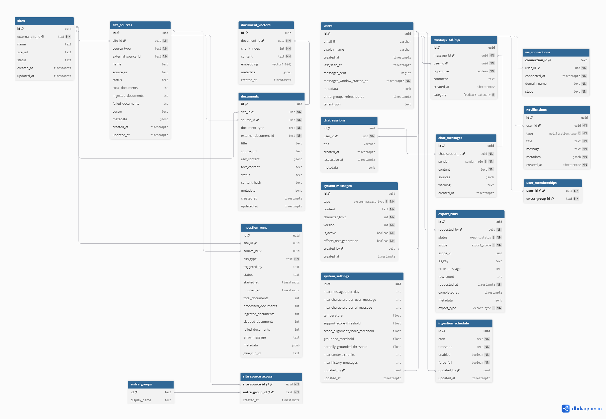

# Architecture Deep Dive

## Architecture

1. The user request is first sent through a security layer which consists of AWS Web Application Firewall (WAF) for Layer 7 protection and AWS Shield for Layer 3 and 4 network protection. Amazon CloudFront acts as the Content Delivery Network (CDN), routing traffic through these security controls before reaching the application.

2. Users access the application through a React frontend hosted on AWS Amplify. Authentication is handled via AWS Cognito, which federates with Microsoft Entra as an external identity provider to verify users' identity. This ensures that only authorized administrators are able to access admin features and the data ingestion pipeline.

3. The frontend communicates with backend services via Representational State Transfer (REST) Application Programming Interface (API) (API Gateway → Lambda) for Create, Read, Update and Delete (CRUD) operations. Access is controlled by Identity and Access Management (IAM) Roles and Policies to ensure secure access to the services required to retain functionality. The WebSocket endpoint is used to stream live responses generated from the Large Language Model (LLM) to the user's frontend.

4. Application data is managed through AWS Lambda functions and stored in Amazon Relational Database Service (RDS) through RDS Proxy, allowing the system to securely handle database requests while improving connection management and performance.

5. Amazon RDS acts as the main Structured Query Language (SQL) database for the platform, storing the structured application data required to support the user experience.

6. Appointed administrators are able to trigger an export of user chat history and analytics data. An AWS Lambda admin function enqueues the export request into an AWS SQS queue, which is processed by an export Lambda function that writes the resulting data as CSV or JSON files into Amazon S3 for storage and retrieval.

7. The export pipeline reads structured chat and analytics data directly from Amazon RDS to produce the exported files.

8. Once an export or significant system event completes, a notification is dispatched back to the relevant administrator through the notifications pipeline.

9. The API also connects to a text generation Lambda function, which is responsible for preparing and sending user prompts into the generative AI workflow.

10. Amazon Bedrock processes the user query together with the retrieved context to generate a grounded response for the user based on the ingested knowledge base content.

11. The database contains LLM settings and prompts that guide it on how to respond to a user. It also contains the chat history needed for the LLM to continue the conversation. The text generation Lambda reads from and writes to Amazon RDS via RDS Proxy to persist and retrieve this data.

12. Appointed administrators are able to trigger the data ingestion pipeline directly from the frontend. This invokes a Lambda function that initiates the ingestion workflow via AWS Glue.

13. Raw data is sourced from Microsoft SharePoint via an external Graph API call. The AWS Glue job performs data extraction and transformation, invoking Amazon Bedrock to narrate and structure the raw content, and a separate Amazon Bedrock embedding model to generate text embeddings. A final Lambda function inserts the resulting embeddings into the RDS vector store.

14. The notifications pipeline uses Amazon Simple Notification Service (SNS) to fan out admin notifications to an AWS Lambda Notification Dispatcher, which delivers alerts to the appropriate administrators upon completion of key pipeline events.

15. The vector embeddings produced by the data ingestion pipeline are stored directly in Amazon RDS, which serves as the vector store for Retrieval-Augmented Generation (RAG). During inference, the text generation Lambda queries RDS using cosine similarity search to retrieve the most relevant context before passing it to Amazon Bedrock for response generation.

---

### Database Schema

### RDS PostgreSQL Tables

---

### Core User & Auth Tables

#### `users` table

| Column Name | Description |
| --- | --- |
| `id` | UUID, primary key |
| `email` | Unique email of the user |
| `display_name` | Display name of the user |
| `created_at` | Timestamp of account creation |
| `last_seen_at` | Timestamp of the user's last activity |
| `messages_sent` | Total number of messages sent by the user |
| `messages_window_started_at` | Timestamp marking the start of the current message window |
| `metadata` | JSONB metadata for additional user information |
| `entra_groups_refreshed_at` | Timestamp of the last Entra group membership sync |
| `tenant_upn` | User Principal Name from Microsoft Entra (used as the primary identity key) |

#### `entra_groups` table

| Column Name | Description |
| --- | --- |
| `id` | Entra group object ID (text), primary key |
| `display_name` | Display name of the group |

#### `user_memberships` table

| Column Name | Description |
| --- | --- |
| `user_id` | Foreign key to users table (cascades on delete) |
| `entra_group_id` | Entra group object ID |

---

### Chat Tables

#### `chat_sessions` table

| Column Name | Description |
| --- | --- |
| `id` | UUID, primary key |
| `user_id` | Foreign key to users table |
| `title` | Title of the chat session |
| `created_at` | Timestamp of creation |
| `last_active_at` | Timestamp of last activity |
| `metadata` | JSONB metadata for session details |

#### `chat_messages` table

| Column Name | Description |
| --- | --- |
| `id` | UUID, primary key |
| `chat_session_id` | Foreign key to chat_sessions table (cascades on delete) |
| `sender` | Sender role (`user`, `AI`) |
| `content` | Message content |
| `sources` | JSONB list of sources used to generate the response |
| `warning` | Warning message attached to the response if applicable |
| `created_at` | Timestamp of message creation |

#### `message_ratings` table

| Column Name | Description |
| --- | --- |
| `id` | UUID, primary key |
| `message_id` | Foreign key to chat_messages table (cascades on delete) |
| `user_id` | Foreign key to users table |
| `is_positive` | Whether the rating is positive or negative |
| `comment` | Optional free-text comment |
| `category` | Feedback category (`Not helpful`, `Inaccurate`, `Off-topic`, `Other`) |
| `created_at` | Timestamp of creation |

---

### System Configuration Tables

#### `system_messages` table

| Column Name | Description |
| --- | --- |
| `id` | UUID, primary key |
| `type` | System message type used in the prompt flow |
| `content` | Content of the system message |
| `character_limit` | Maximum allowed character count for the message |
| `version` | Version number of the system message |
| `is_active` | Whether this version is currently active |
| `affects_text_generation` | Whether this message affects LLM response generation |
| `created_by` | Foreign key to users table |
| `created_at` | Timestamp of creation |

#### `system_settings` table

| Column Name | Description |
| --- | --- |
| `id` | UUID, primary key |
| `max_messages_per_day` | Maximum number of messages a user can send per day |
| `max_characters_per_user_message` | Maximum number of characters allowed in a user message |
| `max_characters_per_ai_message` | Maximum number of characters allowed in an AI message |
| `temperature` | Temperature setting for text generation |
| `support_score_threshold` | Minimum score for a chunk to be considered supporting |
| `scope_alignment_score_threshold` | Minimum score for scope alignment |
| `grounded_threshold` | Score above which a response is considered fully grounded |
| `partially_grounded_threshold` | Score above which a response is considered partially grounded |
| `max_context_chunks` | Maximum number of retrieved chunks passed to the LLM |
| `max_history_messages` | Maximum number of prior messages included in the prompt |
| `updated_by` | Foreign key to users table |
| `updated_at` | Timestamp of last update |

---

### SharePoint Ingestion Tables

#### `sites` table

Represents a single SharePoint site being ingested.

| Column Name | Description |
| --- | --- |
| `id` | UUID, primary key |
| `external_site_id` | SharePoint site ID (unique) |
| `name` | Display name of the site |
| `site_url` | URL of the SharePoint site |
| `status` | Site status (`active`, `inactive`) |
| `created_at` | Timestamp of creation |
| `updated_at` | Timestamp of last update |

#### `site_sources` table

Represents a single SharePoint list within a site.

| Column Name | Description |
| --- | --- |
| `id` | UUID, primary key |
| `site_id` | Foreign key to sites table (cascades on delete) |
| `source_type` | Type of source (e.g. `sharepoint_list`) |
| `external_source_id` | SharePoint list ID |
| `name` | Display name of the list |
| `source_url` | URL of the list |
| `status` | Source status (`active`, `inactive`) |
| `total_documents` | Total number of documents in the source |
| `ingested_documents` | Number of successfully ingested documents |
| `failed_documents` | Number of failed document ingestions |
| `cursor` | Delta token from Microsoft Graph for incremental sync |
| `metadata` | JSONB metadata |
| `created_at` | Timestamp of creation |
| `updated_at` | Timestamp of last update |

#### `site_source_access` table

Maps which Entra groups have access to which site sources, used to filter vector search results per user.

| Column Name | Description |
| --- | --- |
| `site_source_id` | Foreign key to site_sources table (cascades on delete) |
| `entra_group_id` | Foreign key to entra_groups table (cascades on delete) |
| `created_at` | Timestamp of creation |

#### `documents` table

Represents a single SharePoint list item.

| Column Name | Description |
| --- | --- |
| `id` | UUID, primary key |
| `site_id` | Foreign key to sites table (cascades on delete) |
| `source_id` | Foreign key to site_sources table (cascades on delete) |
| `document_type` | Type of document |
| `external_document_id` | SharePoint item ID |
| `title` | Document title |
| `source_url` | URL of the SharePoint item |
| `raw_content` | JSONB raw content as returned by the Graph API |
| `text_content` | Extracted plain text content |
| `status` | Processing status (`pending`, `ingested`, `failed`, `skipped`) |
| `content_hash` | Hash of the content for change detection |
| `metadata` | JSONB metadata |
| `created_at` | Timestamp of creation |
| `updated_at` | Timestamp of last update |

#### `document_vectors` table

Stores chunked embeddings for each document, used for cosine similarity search during RAG inference.

| Column Name | Description |
| --- | --- |
| `id` | UUID, primary key |
| `document_id` | Foreign key to documents table (cascades on delete) |
| `chunk_index` | Chunk position within the document |
| `content` | Text content of the chunk |
| `embedding` | 1024-dimensional vector embedding (pgvector) |
| `metadata` | JSONB metadata (includes Entra group IDs for access control) |
| `created_at` | Timestamp of creation |

An HNSW index on `embedding` using `vector_cosine_ops` (`m = 16`, `ef_construction = 64`) is maintained for efficient approximate nearest-neighbour search.

#### `ingestion_runs` table

Tracks the history of each ingestion job per site and source.

| Column Name | Description |
| --- | --- |
| `id` | UUID, primary key |
| `site_id` | Foreign key to sites table (set null on delete) |
| `source_id` | Foreign key to site_sources table (set null on delete) |
| `run_type` | Type of run (`full`, `incremental`) |
| `triggered_by` | Identity that triggered the run |
| `status` | Run status (`pending`, `running`, `completed`, `failed`) |
| `started_at` | Timestamp when the run started |
| `finished_at` | Timestamp when the run finished |
| `total_documents` | Total documents discovered |
| `processed_documents` | Documents processed |
| `ingested_documents` | Documents successfully ingested |
| `skipped_documents` | Documents skipped (no change detected) |
| `failed_documents` | Documents that failed to ingest |
| `error_message` | Error message if the run failed |
| `glue_run_id` | AWS Glue job run ID for log correlation |
| `metadata` | JSONB metadata |

#### `ingestion_schedule` table

Stores the cron schedule for automated ingestion runs.

| Column Name | Description |
| --- | --- |
| `id` | UUID, primary key |
| `cron` | Cron expression for the schedule |
| `timezone` | Timezone for cron evaluation (default `America/Vancouver`) |
| `enabled` | Whether the schedule is active |
| `force_full` | Whether to force a full re-ingestion instead of incremental |
| `updated_by` | Foreign key to users table |
| `updated_at` | Timestamp of last update |

---

### Export Tables

#### `export_runs` table

Tracks admin-initiated data export requests.

| Column Name | Description |
| --- | --- |
| `id` | UUID, primary key |
| `requested_by` | Foreign key to users table |
| `status` | Export status (`pending`, `processing`, `completed`, `failed`) |
| `scope` | Export scope (`all`, `group`, `user`, `analytics`) |
| `scope_id` | UUID of the scoped entity (e.g. a user or group ID) |
| `export_type` | Type of export (`chat`, `analytics`) |
| `s3_key` | S3 object key where the export file is stored |
| `row_count` | Number of records exported |
| `error_message` | Error message if the export failed |
| `requested_at` | Timestamp when the export was requested |
| `completed_at` | Timestamp when the export completed |
| `metadata` | JSONB metadata |

---

### WebSocket & Notification Tables

#### `ws_connections` table

Tracks active WebSocket connections for streaming LLM responses.

| Column Name | Description |
| --- | --- |
| `connection_id` | API Gateway WebSocket connection ID, primary key |
| `user_id` | Foreign key to users table (cascades on delete) |
| `connected_at` | Timestamp of connection |
| `domain_name` | API Gateway domain |
| `stage` | API Gateway stage |

#### `notifications` table

Stores in-app notifications dispatched to administrators.

| Column Name | Description |
| --- | --- |
| `id` | UUID, primary key |
| `user_id` | Foreign key to users table (cascades on delete) |
| `type` | Notification type (`export_completed`, `export_failed`, `ingestion_completed`, `ingestion_failed`) |
| `title` | Notification title |
| `message` | Notification body |
| `metadata` | JSONB metadata |
| `created_at` | Timestamp of creation |

---

### Enums

#### `sender_role`

Defines who sent a chat message:

- `user`
- `AI`

#### `system_message_type`

Defines the role of a system message in the text generation pipeline:

- `disclaimer`
- `guardrails`
- `system_role`
- `system_instructions`
- `output_format`
- `initial_prompt`
- `welcome_message`
- `partial_hallucination_warning`
- `full_hallucination_warning`

#### `export_status`

Defines the status of an export run:

- `pending`
- `processing`
- `completed`
- `failed`

#### `export_scope`

Defines the scope of an export:

- `all`
- `group`
- `user`
- `analytics`

#### `export_type`

Defines the type of data being exported:

- `chat`
- `analytics`

#### `feedback_category`

Defines the category of a message rating:

- `Not helpful`
- `Inaccurate`
- `Off-topic`
- `Other`

#### `notification_type`

Defines the type of an admin notification:

- `export_completed`
- `export_failed`
- `ingestion_completed`
- `ingestion_failed`
