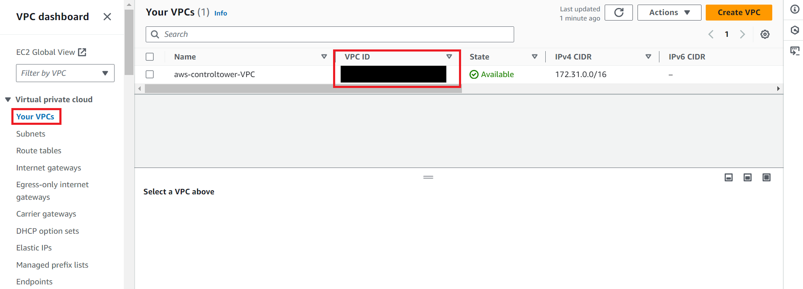
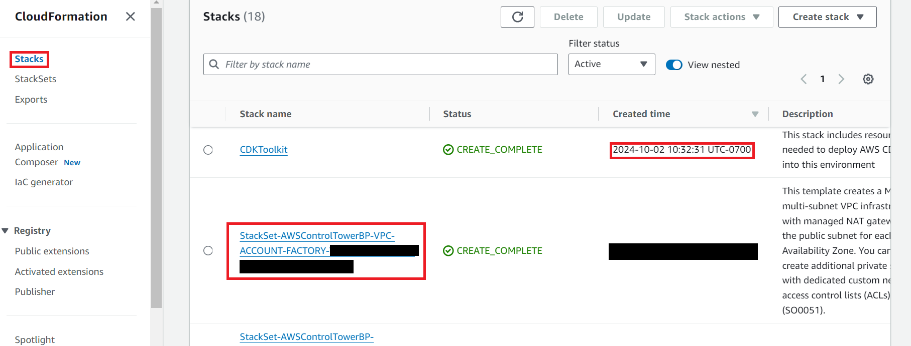

# Deployment Guide

## Table of Contents

- [Deployment Guide](#deployment-guide)
- [Table of Contents](#table-of-contents)
- [Requirements](#requirements)
  - [Request Higher Bedrock LLM Invocation Quotas](#request-higher-bedrock-llm-invocation-quotas)
- [Pre-Deployment](#pre-deployment)
  - [Step 0: Complete Microsoft Entra ID Setup](#step-0-complete-microsoft-entra-id-setup)
  - [Create GitHub Personal Access Token](#create-github-personal-access-token)
- [Deployment](#deployment)
  - [Step 1: Fork \& Clone The Repository](#step-1-fork--clone-the-repository)
  - [Step 2: Upload Secrets \& Parameters](#step-2-upload-secrets--parameters)
  - [Step 3: CDK Deployment](#step-3-cdk-deployment)
- [Post-Deployment](#post-deployment)
  - [Step 1: Build AWS Amplify App](#step-1-build-aws-amplify-app)
  - [Step 2: Configure Admin User](#step-2-configure-admin-user)
  - [Step 3: Visit Web App](#step-3-visit-web-app)
  - [Adding Custom Allowed Origins](#adding-custom-allowed-origins)
- [Troubleshooting](#troubleshooting)
  - [Common Issues](#common-issues)
- [Cleanup](#cleanup)
  - [Taking down the deployed stack](#taking-down-the-deployed-stack)

## Requirements

Before you deploy, you must have the following installed on your device:

- [git](https://git-scm.com/downloads)
- [AWS Account](https://aws.amazon.com/account/)
- [GitHub Account](https://github.com/)
- [AWS CLI](https://aws.amazon.com/cli/) _(v2.0.0+ required)_
- [AWS CDK](https://docs.aws.amazon.com/cdk/v2/guide/cli.html) _(v2.1022.0+ required)_
- [npm](https://docs.npmjs.com/downloading-and-installing-node-js-and-npm) _(v10.0.0+ required)_
- [node](https://nodejs.org/en/learn/getting-started/how-to-install-nodejs) _(v22.7.9+ required)_
- [Python](https://www.python.org/downloads/) _(v3.12+ required)_

### Request Higher Bedrock LLM Invocation Quotas

For optimal performance, it is recommended to request higher invocation quotas for Bedrock LLM models before deployment. The default quotas may be insufficient for processing concurrent requests or high-volume usage.

For detailed information about Bedrock service quotas, see the [AWS Bedrock Service Quotas documentation](https://docs.aws.amazon.com/general/latest/gr/bedrock.html#limits_bedrock).

To request quota increases:

1. Navigate to the **AWS Service Quotas** console in your AWS account
2. Search for "Bedrock" in the service quotas
3. Select the relevant LLM models you plan to use:
   - Anthropic Claude Haiku 4.5 (`us.anthropic.claude-haiku-4-5-20251001-v1:0`)
   - Anthropic Claude Sonnet 4.6 (`us.anthropic.claude-sonnet-4-6`)
   - Amazon Titan Embed Text V2 (`amazon.titan-embed-text-v2:0`)
4. Request quota increases for "Requests per minute" based on your expected usage
5. Submit the quota increase request and wait for AWS approval (this can take 24-48 hours)

_Note: Consider your expected concurrent users and document processing volume when requesting quota increases. Higher quotas ensure smoother operations without throttling._

## Pre-Deployment

### Step 0: Complete Microsoft Entra ID Setup

Before proceeding with any AWS steps, complete all steps in [`Docs/ENTRA_SETUP.md`](./ENTRA_SETUP.md). That guide covers:

- Creating or locating the App Registration in Azure Portal
- Configuring API permissions (Microsoft Graph + SharePoint)
- Ensuring the `upn` claim is always present in tokens
- Registering the Cognito redirect URI
- Generating the client secret and SharePoint certificate
- Storing all credentials in AWS Secrets Manager

The following three secrets **must exist in Secrets Manager before running `cdk deploy`**:

| Secret Name | Type | Contents |
|---|---|---|
| `KBA-SharePoint-Credentials` | Key/value | `tenant_id`, `client_id`, `client_secret`, `site_id` |
| `Sharepoint-REST-Cert-Pfx-B64` | Plaintext | Base64-encoded PFX certificate |
| `Sharepoint-REST-Cert-Pfx-Password` | Plaintext | Certificate password |

See `Docs/ENTRA_SETUP.md` for step-by-step instructions on generating and storing each of these.

### Create GitHub Personal Access Token

To deploy this solution, you will need to generate a GitHub personal access token. Please visit [here](https://docs.github.com/en/authentication/keeping-your-account-and-data-secure/managing-your-personal-access-tokens#creating-a-fine-grained-personal-access-token) for detailed instruction to create a personal access token.

_Note: Make sure to give access to only the repository you forked. Enable Read-only for Contents, and Metadata. For webhooks and Commit statuses enable read and write permissions._

**Once you create a token, please note down its value as you will use it later in the deployment process.**

## Deployment

### Step 1: Fork & Clone The Repository

First, you need to fork the repository. To create a fork, navigate to the main branch of this repository. Then, in the top-right corner, click `Fork`.

You will be directed to the page where you can customize owner, repository name, etc, but you do not have to change any option. Simply click `Create fork` in the bottom right corner.

Now let's clone the GitHub repository onto your machine. To do this:

1. Create a folder on your computer to contain the project code.
2. For an Apple computer, open Terminal. If on a Windows machine, open Command Prompt or Windows Terminal. Enter into the folder you made using the command `cd path/to/folder`. To find the path to a folder on a Mac, right click on the folder and press `Get Info`, then select the whole text found under `Where:` and copy with ⌘C. On Windows (not WSL), enter into the folder on File Explorer and click on the path box (located to the left of the search bar), then copy the whole text that shows up.
3. Clone the GitHub repository by entering the following command. Be sure to replace `<YOUR-GITHUB-USERNAME>` with your own username.

```bash
git clone https://github.com/<YOUR-GITHUB-USERNAME>/knowledge-base-assistant.git
```

The code should now be in the folder you created. Navigate into the root folder containing the entire codebase by running the command:

```bash
cd knowledge-base-assistant
```

#### Install Dependencies

Go into the cdk folder which can be done with the following command:

```bash
cd cdk
```

Now that you are in the cdk directory, install the core dependencies with the following command:

```bash
npm install
```

Go into the frontend folder which can be done with the following command:

```bash
cd ../frontend
```

Now that you are in the frontend directory, install the core dependencies with the following command:

```bash
npm install
```

### Step 2: Upload Secrets & Parameters

All credentials required by the CDK stacks must be stored in AWS Secrets Manager and SSM Parameter Store before deployment. Entra credentials are covered in [Step 0](#step-0-complete-microsoft-entra-id-setup) — this section covers the remaining AWS-side prerequisites.

#### GitHub Personal Access Token

Store the GitHub token you created earlier. Replace `<YOUR-GITHUB-TOKEN>` and `<YOUR-PROFILE-NAME>` accordingly.

<details>
<summary>macOS/Linux</summary>

```bash
aws secretsmanager create-secret \
  --name github-personal-access-token \
  --secret-string '{"my-github-token": "<YOUR-GITHUB-TOKEN>"}' \
  --profile <YOUR-PROFILE-NAME>
```

</details>

<details>
<summary>Windows CMD</summary>

```cmd
aws secretsmanager create-secret ^
  --name github-personal-access-token ^
  --secret-string "{\"my-github-token\": \"<YOUR-GITHUB-TOKEN>\"}" ^
  --profile <YOUR-PROFILE-NAME>
```

</details>

<details>
<summary>PowerShell</summary>

```powershell
aws secretsmanager create-secret `
  --name github-personal-access-token `
  --secret-string '{\"my-github-token\": \"<YOUR-GITHUB-TOKEN>\"}' `
  --profile <YOUR-PROFILE-NAME>
```

</details>

&nbsp;

#### SSM Parameters

**GitHub owner name** — used by AmplifyStack to locate your forked repository. Replace `<YOUR-GITHUB-USERNAME>` and `<YOUR-PROFILE-NAME>` accordingly.

<details>
<summary>macOS/Linux</summary>

```bash
aws ssm put-parameter \
  --name "kba-owner-name" \
  --value "<YOUR-GITHUB-USERNAME>" \
  --type String \
  --profile <YOUR-PROFILE-NAME>
```

</details>

<details>
<summary>Windows CMD</summary>

```cmd
aws ssm put-parameter ^
  --name "kba-owner-name" ^
  --value "<YOUR-GITHUB-USERNAME>" ^
  --type String ^
  --profile <YOUR-PROFILE-NAME>
```

</details>

<details>
<summary>PowerShell</summary>

```powershell
aws ssm put-parameter `
  --name "kba-owner-name" `
  --value "<YOUR-GITHUB-USERNAME>" `
  --type String `
  --profile <YOUR-PROFILE-NAME>
```

</details>

&nbsp;

**Haiku model ARN** (used for lightweight/fast responses):

<details>
<summary>macOS/Linux</summary>

```bash
aws ssm put-parameter \
    --name "/KBA/LLM/HaikuArn" \
    --value "us.anthropic.claude-haiku-4-5-20251001-v1:0" \
    --type String \
    --profile <YOUR-PROFILE-NAME>
```

</details>

<details>
<summary>Windows CMD</summary>

```cmd
aws ssm put-parameter ^
    --name "/KBA/LLM/HaikuArn" ^
    --value "us.anthropic.claude-haiku-4-5-20251001-v1:0" ^
    --type String ^
    --profile <YOUR-PROFILE-NAME>
```

</details>

<details>
<summary>PowerShell</summary>

```powershell
aws ssm put-parameter `
    --name "/KBA/LLM/HaikuArn" `
    --value "us.anthropic.claude-haiku-4-5-20251001-v1:0" `
    --type String `
    --profile <YOUR-PROFILE-NAME>
```

</details>

&nbsp;

### Step 3: CDK Deployment

It's time to set up everything that goes on behind the scenes! For more information on how the backend works, feel free to refer to the Architecture documentation, but an understanding of the backend is not necessary for deployment.

If you are new to CDK, note that the AWS Cloud Development Kit (CDK) lets you define cloud infrastructure using code. Review the [AWS CDK Documentation](https://docs.aws.amazon.com/cdk/) for a quick primer before proceeding.

Open a terminal in the `/cdk` directory.

#### CDK Deployment with an Existing VPC (Optional)

The following instructions are only relevant if you want to deploy this application using an **existing VPC** (e.g., an AWS Control Tower-managed VPC). If you are deploying with a new VPC, skip this section and proceed to [Initialize the CDK stack](#initialize-the-cdk-stack).

To use an existing VPC, you will need access to the **aws-controltower-VPC** and the name of your **AWSControlTowerStackSet**.

##### Step-by-Step Instructions

**1. Set your existing VPC ID**

Open `cdk/lib/vpc-stack.ts` and set the `existingVpcId` variable to your existing VPC ID:

```typescript
const existingVpcId: string = "your-vpc-id"; // CHANGE IF DEPLOYING WITH EXISTING VPC
```

You can find your VPC ID in the **VPC dashboard** of the AWS Console under **Your VPCs**.



**2. Set your AWS Control Tower Stack Set name**

In the same file, update the `AWSControlTowerStackSet` variable with your stack set name:

```typescript
const AWSControlTowerStackSet = "your-stackset-name"; // CHANGE TO YOUR CONTROL TOWER STACK SET
```

You can find this in the **CloudFormation** console under **Stacks**. Look for a stack whose name starts with `StackSet-AWSControlTowerBP-VPC-ACCOUNT-FACTORY`.



The stack set name is used to import the private subnet IDs, route table IDs, and subnet CIDR ranges via CloudFormation exports — so it must match exactly.

---

##### Second Deployment in the Same Environment with an Existing VPC

The following instructions only apply if this is the **second project** you are deploying into the same existing VPC. If this is your first deployment, skip this section.

When deploying a second project into the same VPC, a new public subnet is created for the NAT Gateway. You need to provide an available **Public Subnet ID** from the first deployment and an unused **CIDR range** within the VPC.

**1. Set the existing public subnet ID**

Update the `existingPublicSubnetID` variable in `cdk/lib/vpc-stack.ts`:

```typescript
const existingPublicSubnetID: string = "your-public-subnet-id"; // CHANGE IF DEPLOYING WITH EXISTING PUBLIC SUBNET
```

To find the public subnet ID:
- Go to **VPC → Subnets** in the AWS Console
- Identify the public subnet from your first deployment (it will have a route table entry pointing to an Internet Gateway)
- Copy its **Subnet ID**

**2. Update the public subnet CIDR range**

The `publicSubnetCidr` variable defines the CIDR block for the new public subnet. It must not overlap with any existing subnets in the VPC:

```typescript
const publicSubnetCidr = "172.31.0.0/20"; // Must not overlap with private subnets
```

To find an available CIDR block:
- Go to **VPC → Subnets** and note the CIDR blocks of all existing subnets in your VPC
- The third octet of a `/20` block must be a **multiple of 16** within the VPC range (e.g., `172.31.0.0/20`, `172.31.16.0/20`, `172.31.32.0/20`, etc.)
- Pick the first unused block

For example, if existing subnets use `172.31.0.0/20` and `172.31.16.0/20`, use `172.31.32.0/20` as your next available range.

---

#### Initialize the CDK stack

**Initialize the CDK stack** (required only if you have not deployed any resources with CDK in this region before). Please replace `<YOUR-PROFILE-NAME>` with the appropriate AWS profile used earlier.

```bash
cdk synth \
  --context StackPrefix=<YOUR-STACK-PREFIX> \
  --context environment=dev \
  --context versionNumber=1.0.0 \
  --context githubRepo=knowledge-base-assistant \
  --context githubBranch=main \
  --profile <YOUR-PROFILE-NAME>

cdk bootstrap \
  aws://<YOUR_AWS_ACCOUNT_ID>/<YOUR_ACCOUNT_REGION> \
  --profile <YOUR-PROFILE-NAME>
```

#### Deploy CDK stack

You may run the following command to deploy the stacks all at once. Replace `<YOUR-PROFILE-NAME>` with the appropriate AWS profile and `<YOUR-STACK-PREFIX>` with your chosen stack prefix.

> **StackPrefix note:** The prefix is lowercased and used as the Cognito hosted UI domain (e.g. `StackPrefix=CUCCIO` → `cuccio.auth.ca-central-1.amazoncognito.com`). It must be **globally unique** across all AWS Cognito deployments. Use the same prefix you registered in Entra's redirect URI in `Docs/ENTRA_SETUP.md` Section 4.

```bash
cdk deploy --all \
  --context StackPrefix=<YOUR-STACK-PREFIX> \
  --context environment=dev \
  --context versionNumber=1.0.0 \
  --context githubRepo=knowledge-base-assistant \
  --context githubBranch=main \
  --profile <YOUR-PROFILE-NAME>
```

**Note:** The deployment process may take 15-30 minutes to complete.

#### Stacks Deployed

The CDK deployment creates the following stacks in dependency order:

| Stack | Description |
|---|---|
| `<PREFIX>-VpcStack` | VPC, subnets, NAT gateway, and VPC endpoints |
| `<PREFIX>-Database` | RDS PostgreSQL 17 instance and RDS Proxy |
| `<PREFIX>-DBFlow` | Database migration Lambda and schema setup (runs on deploy) |
| `<PREFIX>-Glue` | AWS Glue job for SharePoint ingestion pipeline |
| `<PREFIX>-CICD` | CodePipeline and CodeBuild for CI/CD |
| `<PREFIX>-Api` | API Gateway (REST + WebSocket), Lambda functions, Cognito User Pool, WAF |
| `<PREFIX>-Amplify` | AWS Amplify app connected to your GitHub repository |

### Authorize the GitHub Connection (Required After First Deploy)

The CICD stack creates a GitHub connection via AWS CodeConnections to allow CodePipeline to pull source code. This connection must be **manually authorized** in the AWS Console before the pipeline can run — it will remain in a `PENDING` state until you do this.

1. After CDK deployment completes, go to **AWS Console → Developer Tools → Settings → Connections** (or search "CodeConnections").
2. Find the connection named `<STACK-PREFIX>-CICD-github-conn` with status `Pending`.
3. Click on it, then click **Update pending connection**.
4. Follow the prompts to authorize access to your GitHub account and your forked repository.
5. Once authorized, the connection status will change to `Available`.

_Note: The CDK output `GitHubConnectionArn` shows the ARN of this connection for reference._

---

## Post-Deployment

### Step 1: Build AWS Amplify App

1. Log in to AWS console, and navigate to **AWS Amplify**. You can do so by typing `Amplify` in the search bar at the top.
2. From `All apps`, click `<STACK-PREFIX>-amplify`.
3. Click on the `main` branch.
4. Click `Redeploy this version` to trigger a build.
5. Wait for the build to complete (this may take 5-10 minutes).
6. You now have access to the `Amplify App ID` and the public domain name to use the web app.

### Step 2: Configure Admin User

Admin sign-in is handled entirely through Microsoft Entra SSO — users are created automatically in Cognito on first login. There are no manual Cognito user creation steps.

**To grant admin access to a user:**

1. Have the user sign in to the app at least once using their Microsoft account. This creates their Cognito profile automatically.
2. Navigate to **AWS Cognito** in the AWS Console.
3. Find the User Pool named `<STACK-PREFIX>-UserPool`.
4. Click **Users** in the left sidebar and locate the user by their email or username.
5. Select the user → **Group memberships** → **Add user to group** → select `admin` → **Add**.
6. The user must **sign out and sign back in** for the admin group membership to take effect in their session token.

> All users who successfully authenticate via Entra are automatically added to the `users` group. Only users explicitly added to the `admin` group can access admin dashboard endpoints.

### Step 3: Visit Web App

You can now navigate to the web app URL (found in the Amplify console) to see your application in action.

**Default URL format:** `https://main.<app-id>.amplifyapp.com`

### Adding Custom Allowed Origins

The application stores allowed CORS origins in an SSM parameter (`/<STACK-PREFIX>-Api/API/AllowedOrigins`). The Amplify URL is added automatically during deployment. When this parameter is updated, the `cognitoOriginSync` Lambda fires automatically via EventBridge and updates the Cognito callback/logout URLs to match.

If you need to allow additional origins (e.g., a custom domain or localhost for development), update the parameter manually:

<details>
<summary>macOS/Linux</summary>

```bash
# First, read the current value
aws ssm get-parameter \
  --name "/<STACK-PREFIX>-Api/API/AllowedOrigins" \
  --profile <YOUR-PROFILE-NAME> \
  --query Parameter.Value --output text

# Then update with the new origin appended (comma-separated, no trailing slashes)
aws ssm put-parameter \
  --name "/<STACK-PREFIX>-Api/API/AllowedOrigins" \
  --value "https://main.abc123.amplifyapp.com,https://your-custom-domain.com" \
  --type String \
  --overwrite \
  --profile <YOUR-PROFILE-NAME>
```

</details>

<details>
<summary>PowerShell</summary>

```powershell
# First, read the current value
aws ssm get-parameter `
  --name "/<STACK-PREFIX>-Api/API/AllowedOrigins" `
  --profile <YOUR-PROFILE-NAME> `
  --query Parameter.Value --output text

# Then update with the new origin appended (comma-separated, no trailing slashes)
aws ssm put-parameter `
  --name "/<STACK-PREFIX>-Api/API/AllowedOrigins" `
  --value "https://main.abc123.amplifyapp.com,https://your-custom-domain.com" `
  --type String `
  --overwrite `
  --profile <YOUR-PROFILE-NAME>
```

</details>

&nbsp;

_Note: Always read the current value first and append your new origin to avoid removing existing ones. Origins must not have trailing slashes. Updating this parameter automatically triggers the `cognitoOriginSync` Lambda to update Cognito's allowed callback and logout URLs._

## Troubleshooting

### Common Issues

**Issue: CDK deployment fails with "Resource already exists"**

- Solution: Check if you have existing resources with the same names. Either delete them or use a different stack prefix.

**Issue: CloudFormation validation error during ResourceExistenceCheck referencing DataPipeline or CICD ARNs**

- Symptoms: CloudFormation throws a validation error during the change set or deployment phase, related to a `ResourceExistenceCheck` for an ARN that appears to reference the `DataPipeline` or `CICD` resources.
- Solution: This commonly occurs on first-time deployments when the pipeline resources are created but referenced in IAM policy statements before they exist. Authorize the GitHub connection (see [Authorize the GitHub Connection](#authorize-the-github-connection-required-after-first-deploy)) and redeploy.

**Issue: Amplify build fails**

- Solution: Check the build logs in Amplify console. Common causes:
  - Missing environment variables
  - Node version mismatch
  - Dependency installation failures

**Issue: Database connection errors**

- Solution: Verify that:
  - RDS instance is running
  - Security groups allow Lambda to access RDS
  - Database credentials are correct in Secrets Manager

**Issue: CORS errors in browser**

- Solution: Verify that the `/<STACK-PREFIX>-Api/API/AllowedOrigins` SSM parameter includes your Amplify domain. See [Adding Custom Allowed Origins](#adding-custom-allowed-origins).

**Issue: WebSocket connection fails**

- Solution: Check that:
  - WebSocket API is deployed
  - Lambda functions have correct permissions
  - Frontend is using the correct WebSocket URL

**Issue: Text generation Lambda fails with parameter not found error**

- Solution: Ensure the `/KBA/LLM/HaikuArn` and `/KBA/LLM/SonnetArn` SSM parameters were created before deployment. See [Step 2: Upload Secrets & Parameters](#step-2-upload-secrets--parameters).

**Issue: Glue ingestion job fails**

- Solution:
  - Verify the three Entra secrets exist in Secrets Manager (`KBA-SharePoint-Credentials`, `Sharepoint-REST-Cert-Pfx-B64`, `Sharepoint-REST-Cert-Pfx-Password`).
  - Check that admin consent was granted for all required API permissions (see `Docs/ENTRA_SETUP.md` Section 2).
  - Check CloudWatch logs for the Glue job under `/aws-glue/jobs/`.
  - Confirm the Glue job's IAM role has access to Secrets Manager, Bedrock (Titan), and the RDS VPC.

**Issue: Admin login fails or redirect loop after Microsoft sign-in**

- Solution:
  - Verify the Cognito redirect URI registered in Entra exactly matches `https://<StackPrefix>.auth.<region>.amazoncognito.com/oauth2/idpresponse` (see `Docs/ENTRA_SETUP.md` Section 4).
  - Confirm `upn` optional claim is configured in the App Registration (see `Docs/ENTRA_SETUP.md` Section 3).
  - Check CloudWatch logs for `/aws/lambda/<STACK-PREFIX>-addMemberOnSignUp`.

## Cleanup

### Taking down the deployed stack

To take down the deployed stack for a fresh redeployment in the future, follow these steps in order:

1. **Disable RDS Deletion Protection:**
   - Navigate to **Amazon RDS** in the AWS Console
   - Click on "Databases" in the left sidebar
   - Select the database instance named `<STACK-PREFIX>-database`
   - Click "Modify"
   - Scroll down to "Deletion protection" and uncheck the box
   - Click "Continue" and then "Modify DB instance"
   - Wait for the modification to complete before proceeding

2. **Delete CloudFormation Stacks:**
   Navigate to AWS CloudFormation console and delete stacks in this order:
   - `<STACK-PREFIX>-Amplify`
   - `<STACK-PREFIX>-Api`
   - `<STACK-PREFIX>-Glue`
   - `<STACK-PREFIX>-CICD`
   - `<STACK-PREFIX>-DBFlow`
   - `<STACK-PREFIX>-Database`
   - `<STACK-PREFIX>-VpcStack`

3. **Delete Secrets:**
   - Navigate to AWS Secrets Manager
   - Delete the following secrets:
     - `github-personal-access-token`
     - `KBA-SharePoint-Credentials`
     - `Sharepoint-REST-Cert-Pfx-B64`
     - `Sharepoint-REST-Cert-Pfx-Password`
     - Any database credentials created by the stack

4. **Delete SSM Parameters:**
   - Navigate to AWS Systems Manager → Parameter Store
   - Delete the following parameters:
     - `kba-owner-name`
     - `/KBA/LLM/HaikuArn`
     - `/<STACK-PREFIX>-Api/API/AllowedOrigins`

5. **Delete ECR Repositories** (if any were created):
   - Navigate to Amazon ECR
   - Delete any repositories created by the CICD stack

6. **Verify Cleanup**:
   - Check CloudWatch Logs for any remaining log groups
   - Check Lambda functions for any remaining functions
   - Check API Gateway for any remaining APIs

**Note:** Please wait for each stack to be properly deleted before deleting the next stack. Some resources have dependencies that must be removed first.

**Cost Warning:** Ensure all resources are deleted to avoid ongoing charges. Pay special attention to:

- RDS instances
- NAT Gateways
- Elastic IPs
- CloudWatch Logs retention
