# Microsoft Entra ID Setup Guide

This guide covers every step required to configure Microsoft Entra ID (Azure AD) as the identity provider for the KBA application. It must be completed **before** running `cdk deploy`. The Deployment Guide (`Docs/DEPLOYMENT_GUIDE.md`) cites this document for all Entra-related steps.

---

## Overview

When an admin clicks "Sign in with Microsoft", this is the full flow:

1. Frontend calls Amplify `signInWithRedirect` → user is sent to the Cognito Hosted UI
2. Cognito redirects to Microsoft's login page (via OIDC)
3. User authenticates with their organizational Microsoft account
4. Microsoft returns an OIDC ID token to Cognito's callback URL
5. Cognito creates or finds the user in the User Pool and issues its own JWT
6. A Lambda trigger fires on every login — it upserts the user into RDS and syncs their Entra group memberships via Graph API
7. User lands back in the app, authenticated

The **same App Registration** is used for two purposes: admin sign-in (OIDC federation with Cognito) and the SharePoint ingestion pipeline (Graph API client credentials flow). This is intentional — one registration, one set of credentials stored in a single Secrets Manager secret.

---

## Prerequisites

Before starting, confirm you have:

- Access to the **Azure Portal** with a role of **Application Administrator** or higher in the Entra tenant
- Access to the **AWS Console** with permissions to read and write Secrets Manager secrets
- The **Tenant ID** — find it at Azure Portal → Microsoft Entra ID → Overview → Tenant ID

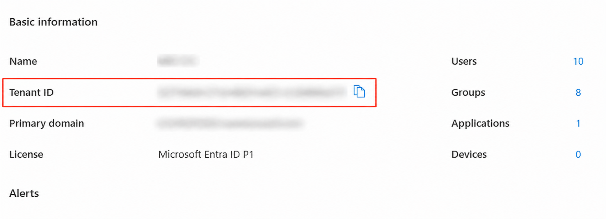

---

## Section 1 — Set Up the App Registration

You need an Entra App Registration to serve as the identity for both admin sign-in and the SharePoint ingestion pipeline. You can either reuse an existing application or create a new one.

**Option A — Use an existing App Registration:**
1. Azure Portal → Microsoft Entra ID → **App Registrations** → **All applications**
2. Select the application you want to use
3. On the Overview page, note the **Application (client) ID** — you will need it in Section 6

**Option B — Create a new App Registration:**
1. Azure Portal → Microsoft Entra ID → **App Registrations** → **New registration**
2. Name: `KBA Application` (internal — not user-facing)
3. Supported account types: **Accounts in this organizational directory only** (single tenant)
4. Redirect URI: leave blank for now (configured in Section 4)
5. Click **Register**
6. On the Overview page, note the **Application (client) ID** — you will need both in Section 6

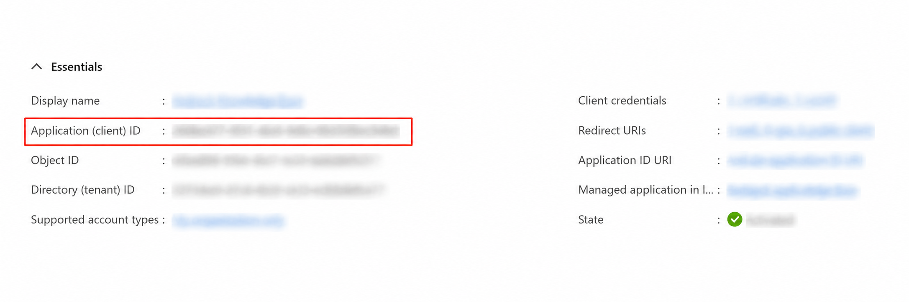

---

## Section 2 — Configure API Permissions

The following permissions are required across two APIs. Microsoft Graph handles both OIDC sign-in and the Lambda group sync. SharePoint is used by the Glue ingestion job to read site content.

**Microsoft Graph**

| Permission | Type | Admin Consent | Purpose |
|---|---|---|---|
| `email` | Delegated | No | OIDC sign-in — include email in token |
| `profile` | Delegated | No | OIDC sign-in — include profile in token |
| `User.Read` | Delegated | No | OIDC sign-in — read user profile |
| `User.Read.All` | **Application** | **Yes** | Lambda looks up users by UPN |
| `GroupMember.Read.All` | **Application** | **Yes** | Lambda fetches transitive group memberships |
| `Sites.Read.All` | **Application** | **Yes** | Glue job reads SharePoint site content |

**SharePoint**

| Permission | Type | Admin Consent | Purpose |
|---|---|---|---|
| `Sites.FullControl.All` | **Application** | **Yes** | Glue job full access to SharePoint site collections |

**Steps:**
1. Azure Portal → Microsoft Entra ID → **App Registrations** → select your application
2. In the left sidebar, expand **Manage** → click **API permissions**
3. Add all Microsoft Graph permissions above (**Add a permission** → **Microsoft Graph** → select Delegated or Application as appropriate)
4. Add the SharePoint permission (**Add a permission** → **SharePoint** → **Application permissions** → `Sites.FullControl.All`)
5. Click **Grant admin consent for [your organization]**

> ⚠️ **Admin consent is mandatory.** Adding the permissions without clicking grant consent leaves them listed but inactive. The Lambda will receive `403 Authorization_RequestDenied` from Graph on every login until consent is granted. Both Application permission rows must show a green checkmark labeled "Granted for [org]."

**Step 1 — Navigate to API permissions:**

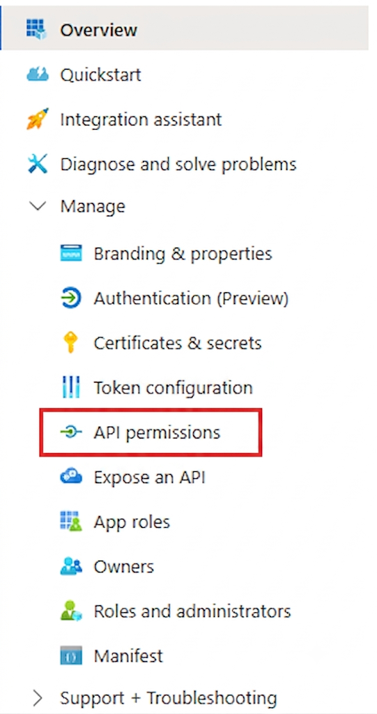

**Step 2 — Verify all permissions are granted:**

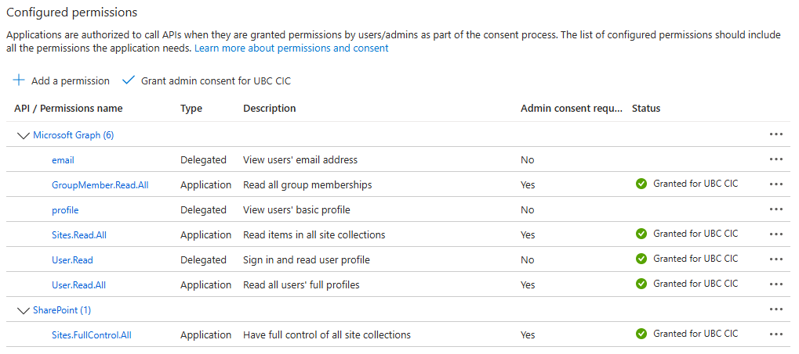

---

## Section 3 — Ensure UPN Is Always Present in Tokens

This is the most critical reliability step. The entire auth pipeline depends on the `upn` claim being present in every login token. `upn` is included by default for most organizational accounts, but without explicit configuration it can be silently omitted for guest/B2B accounts or when tenant policy restricts claim emission. A missing `upn` causes `custom:upn` to be empty in Cognito, which breaks user creation and group sync.

**Step 1 — Navigate to Token configuration:**

1. Azure Portal → Microsoft Entra ID → **App Registrations** → select your application
2. In the left sidebar, expand **Manage** → click **Token configuration**

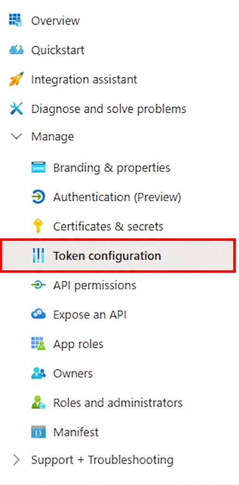

**Step 2 — Add optional claims:**

1. Click **Add optional claim**
2. Select token type: **ID**
3. Check **`upn`**, **`email`**, **`family_name`**, **`given_name`** → **Add**

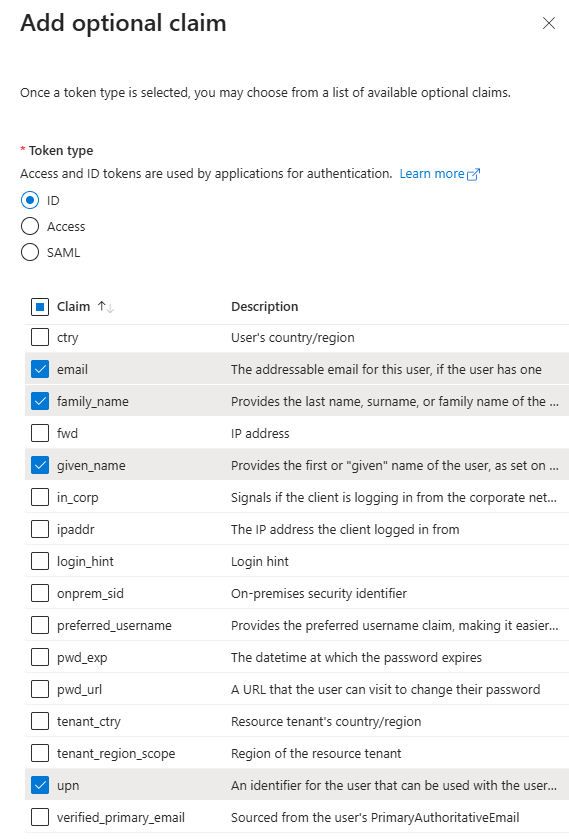

**Step 3 — Verify the Manifest:**

Adding claims via the UI automatically updates the app manifest. In the left sidebar, expand **Manage** → click **Manifest**. This is a large JSON file — search for the `"optionalClaims"` key and confirm it looks like this:

```json
"optionalClaims": {
    "accessToken": [],
    "idToken": [
        {
            "additionalProperties": [],
            "essential": false,
            "name": "email",
            "source": null
        },
        {
            "additionalProperties": [
                "include_externally_authenticated_upn"
            ],
            "essential": true,
            "name": "upn",
            "source": null
        },
        {
            "additionalProperties": [],
            "essential": false,
            "name": "family_name",
            "source": null
        },
        {
            "additionalProperties": [],
            "essential": false,
            "name": "given_name",
            "source": null
        }
    ],
    "saml2Token": []
},
```

> ⚠️ Two things are critical here: `"essential": true` means if `upn` cannot be issued, the token request fails explicitly rather than silently omitting it. `"include_externally_authenticated_upn"` in `additionalProperties` ensures the UPN is included for external/guest B2B accounts — this was the root cause of missing UPNs in testing. If either is missing, edit the JSON directly in the Manifest editor and save.

**What NOT to configure:**
- Do not add `oid` as an optional claim — Entra blocks this claim type
- Do not use `email` (`mail`) as the primary identifier — the `mail` property is null for many organizational accounts
- Do not rely on `name` — it can be blocked by tenant policy

**Guest / B2B accounts (`#EXT#` format):**

External users have a UPN in the format `firstname_contoso.com#EXT#@yourtenant.onmicrosoft.com`. This is expected and handled — the Lambda parses the `#EXT#` format into a human-readable display email while using the raw UPN as the identifier. As long as `upn` is present in the token, the pipeline works correctly.

> ⚠️ When inviting an external user to an Entra group, make sure their UPN is in this `#EXT#` format. Failing to do so will cause the authentication pipeline to break.


## Section 4 — Configure the Redirect URI

Cognito's hosted UI is the callback receiver — not the frontend. The browser sends the authorization code to Cognito's server, which exchanges it with Entra for tokens.

This step must be done **before deployment** — you need to decide your `StackPrefix` and register the URI in Entra so it is ready when Cognito is created.

The redirect URI follows this pattern:

```
https://<StackPrefix>.auth.<region>.amazoncognito.com/oauth2/idpresponse
```

For example, if your `StackPrefix` is `CUCCIO` and your region is `ca-central-1`:

```
https://cuccio.auth.ca-central-1.amazoncognito.com/oauth2/idpresponse
```

Use the same `StackPrefix` and region you will pass to `cdk deploy`. The prefix is lowercased automatically by CDK.

**Step 1 — Navigate to Authentication:**

Azure Portal → Microsoft Entra ID → **App Registrations** → select your application → expand **Manage** → click **Authentication**

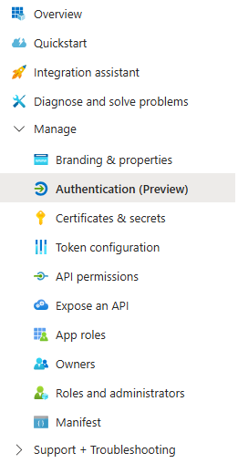

**Step 2 — Click Add Redirect URI:**

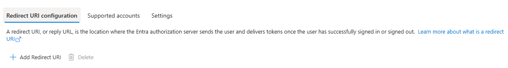

**Step 3 — Select Web as the platform:**

> **Why Web, not SPA:** The callback goes to Cognito's server (`amazoncognito.com`), not the browser. Cognito handles the token exchange server-side and then redirects to the frontend.

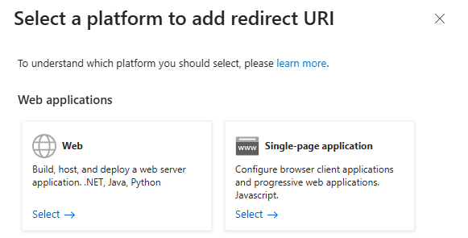

**Step 4 — Paste your redirect URI and save:**

Paste the URI you constructed above and click **Save**.

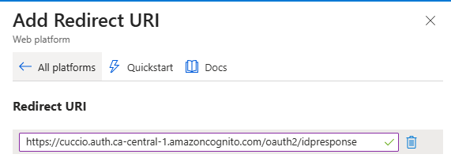

---

## Section 5 — Certificates & Secrets

Both the client secret (for Cognito OIDC + Graph API) and the SharePoint certificate (for the Glue ingestion job) live under the same **Certificates & secrets** page on the App Registration.

Navigate there first: Azure Portal → Microsoft Entra ID → **App Registrations** → select your application → expand **Manage** → **Certificates & secrets**

---

### Part A — Generate a Client Secret

1. Click **Client secrets** tab → **New client secret**
2. Description: `KBA Production`
3. Expiry: 12 or 24 months (note the expiry date — you will need to rotate before this date; see Section 11)
4. Click **Add**
5. **Copy the Value immediately** — it is only shown once

> ⚠️ **Copy the Value, not the Secret ID.** The Value is a long random string like `abc~...`. The Secret ID is a UUID — it cannot authenticate anything.

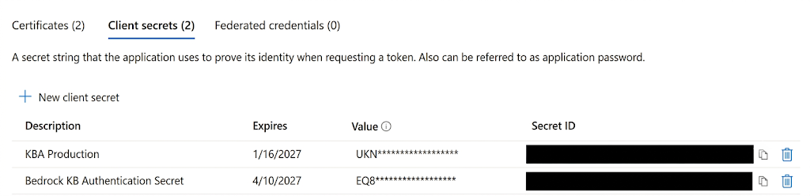

---

### Part B — Generate and Register the SharePoint Certificate

The Glue ingestion job authenticates to the SharePoint REST API using a certificate — not the client secret. You need to generate a certificate, register the public key in Entra, and store the private key (PFX) in Secrets Manager.

**Step 1 — Generate a self-signed certificate:**

**Mac / Linux (requires OpenSSL):**

```bash
# Generate private key and self-signed certificate
openssl req -x509 -newkey rsa:2048 -keyout key.pem -out cert.pem -days 730 -nodes \
  -subj "/CN=KBA-SharePoint"

# Export as PFX with a password
openssl pkcs12 -export -out cert.pfx -inkey key.pem -in cert.pem -passout pass:YourPasswordHere
```

**Windows (PowerShell — no OpenSSL required):**

```powershell
$password = ConvertTo-SecureString -String "YourPasswordHere" -Force -AsPlainText

# Generate certificate and export PFX (contains private key — goes to Secrets Manager)
$cert = New-SelfSignedCertificate -Subject "CN=KBA-SharePoint" -CertStoreLocation "Cert:\CurrentUser\My" -NotAfter (Get-Date).AddDays(730) -KeyExportPolicy Exportable
Export-PfxCertificate -Cert $cert -FilePath "C:\Users\YourUsername\cert.pfx" -Password $password

# Export public certificate for upload to Entra (public key only — goes to Azure Portal)
Export-Certificate -Cert $cert -FilePath "C:\Users\YourUsername\cert.cer" -Type CERT
```

> ⚠️ Use absolute paths in the `-FilePath` arguments (e.g. `C:\Users\YourUsername\cert.pfx`). Relative paths can silently write to a different directory and cause "file not found" errors in the next step.

Note the password you used — you will need it in Section 6.

> **Two files, two destinations:**
> - `cert.pfx` (or `cert.pfx` on Mac/Linux) — contains the **private key**. This is base64-encoded and stored in Secrets Manager. Never upload this to Entra.
> - `cert.cer` (Windows) / `cert.pem` (Mac/Linux) — contains the **public key only**. This is uploaded to Entra. It is safe to share.

**Step 2 — Upload the public certificate to Entra:**

1. On the **Certificates & secrets** page, click the **Certificates** tab
2. Click **Upload certificate**
3. Select `cert.cer` (Windows) or `cert.pem` (Mac/Linux) — the public certificate
4. Click **Add**

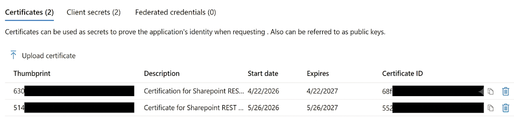

**Step 3 — Base64-encode the PFX for Secrets Manager:**

> ⚠️ Base64-encode the **`.pfx` file only** — not the `.cer` or `.pem`. The `.pfx` contains the private key that the Glue job needs to authenticate.

**Mac / Linux:**
```bash
base64 -i cert.pfx | tr -d '\n'
```

**Windows (PowerShell):**
```powershell
# Replace with the absolute path where cert.pfx was saved in Step 1
[Convert]::ToBase64String([IO.File]::ReadAllBytes("C:\Users\YourUsername\cert.pfx"))
```

> ⚠️ On Windows, always use the **absolute path** (e.g. `C:\Users\YourUsername\cert.pfx`). Using just `"cert.pfx"` will fail with a file not found error unless your terminal happens to be in the same directory.

Copy the output — this is the value you will store as `Sharepoint-REST-Cert-Pfx-B64` in Section 6.

---

## Section 6 — Store Credentials in AWS Secrets Manager

All three secrets below must exist in Secrets Manager **before** running `cdk deploy`. You can create them via the AWS Console or using the CLI commands below. Replace all placeholder values before running.

---

### Secret 1 — `KBA-SharePoint-Credentials`

| Key | Value |
|---|---|
| `tenant_id` | Tenant ID from Prerequisites |
| `client_id` | Application (client) ID from Section 1 |
| `client_secret` | Client secret Value from Section 5A |
| `site_id` | Your SharePoint site ID (found via Graph API or SharePoint admin) |

This secret is used by both the Cognito OIDC flow and the Glue ingestion job.

<details>
<summary>macOS/Linux</summary>

```bash
aws secretsmanager create-secret \
  --name "KBA-SharePoint-Credentials" \
  --secret-string '{
    "tenant_id": "<YOUR-TENANT-ID>",
    "client_id": "<YOUR-CLIENT-ID>",
    "client_secret": "<YOUR-CLIENT-SECRET>",
    "site_id": "<YOUR-SHAREPOINT-SITE-ID>"
  }' \
  --profile <YOUR-PROFILE-NAME>
```

</details>

<details>
<summary>PowerShell</summary>

```powershell
aws secretsmanager create-secret `
  --name "KBA-SharePoint-Credentials" `
  --secret-string '{\"tenant_id\": \"<YOUR-TENANT-ID>\", \"client_id\": \"<YOUR-CLIENT-ID>\", \"client_secret\": \"<YOUR-CLIENT-SECRET>\", \"site_id\": \"<YOUR-SHAREPOINT-SITE-ID>\"}' `
  --profile <YOUR-PROFILE-NAME>
```

</details>

---

### Secret 2 — `Sharepoint-REST-Cert-Pfx-B64`

Store the base64-encoded PFX string from Section 5B as a plaintext secret. Replace `<BASE64-PFX-STRING>` with the output of the base64 command from Section 5B Step 3.

<details>
<summary>macOS/Linux</summary>

```bash
aws secretsmanager create-secret \
  --name "Sharepoint-REST-Cert-Pfx-B64" \
  --secret-string "<BASE64-PFX-STRING>" \
  --profile <YOUR-PROFILE-NAME>
```

</details>

<details>
<summary>PowerShell</summary>

```powershell
aws secretsmanager create-secret `
  --name "Sharepoint-REST-Cert-Pfx-B64" `
  --secret-string "<BASE64-PFX-STRING>" `
  --profile <YOUR-PROFILE-NAME>
```

</details>

---

### Secret 3 — `Sharepoint-REST-Cert-Pfx-Password`

Store the certificate password you used in Section 5B Step 1.

<details>
<summary>macOS/Linux</summary>

```bash
aws secretsmanager create-secret \
  --name "Sharepoint-REST-Cert-Pfx-Password" \
  --secret-string "<YOUR-CERTIFICATE-PASSWORD>" \
  --profile <YOUR-PROFILE-NAME>
```

</details>

<details>
<summary>PowerShell</summary>

```powershell
aws secretsmanager create-secret `
  --name "Sharepoint-REST-Cert-Pfx-Password" `
  --secret-string "<YOUR-CERTIFICATE-PASSWORD>" `
  --profile <YOUR-PROFILE-NAME>
```

</details>

---

## Section 7 — Deploy the CDK Stacks

All Entra prerequisites are now complete. Follow `Docs/DEPLOYMENT_GUIDE.md` to run `cdk deploy`. No `-c` context flags are needed for Entra credentials — the CDK resolves them from Secrets Manager automatically.

After deployment, the CDK creates:
- A Cognito User Pool with `EntraID` as an OIDC identity provider
- A Cognito Hosted UI domain at `https://<StackPrefix>.auth.<region>.amazoncognito.com`
- Two Cognito groups: `admin` and `users`
- The `addUserOnSignUp` Lambda wired to both `POST_AUTHENTICATION` and `POST_CONFIRMATION` triggers

---


## Appendix A — OIDC Attribute Mapping

How Entra token claims map to Cognito user attributes (authoritative from `cdk/lib/api-stack.ts`):

| Entra OIDC claim | Cognito attribute | Notes |
|---|---|---|
| `upn` | `custom:upn` | Primary identifier — the whole auth pipeline depends on this |
| `given_name` | `given_name` | Standard OIDC claim |
| `family_name` | `family_name` | Standard OIDC claim |

The `addUserOnSignUp` Lambda reads `userAttributes['custom:upn']`. For guest/B2B accounts, it parses the `#EXT#` format into a human-readable display email while preserving the raw UPN for Graph API lookups.

---

## Appendix B — What the addUserOnSignUp Lambda Does

Fires on `POST_AUTHENTICATION` (every login) and `POST_CONFIRMATION` (first login for federated users). Both triggers are wired because Cognito fires `POST_CONFIRMATION` instead of `POST_AUTHENTICATION` on a federated user's very first login.

On every login the Lambda:

1. Reads `custom:upn` from the Cognito trigger event
2. Parses `#EXT#` UPN format for guest users into a display email
3. Upserts the user into RDS `users` table (Cognito `sub` as primary key)
4. Calls `AdminAddUserToGroup` to add the user to the `users` Cognito group
5. Fetches a Graph API token via client credentials flow (tenant, client ID, client secret from Secrets Manager)
6. Calls `GET /v1.0/users/{upn}/transitiveMemberOf/microsoft.graph.group` to get all Entra group memberships
7. Atomically replaces rows in the `user_memberships` table for this user

Steps 5–7 are wrapped in try/catch — a Graph API failure never blocks login. Group sync is best-effort and retried on the next login.

The Graph token is cached in a module-level variable and reused across warm Lambda invocations, refreshing 60 seconds before expiry.

---

## Appendix C — Troubleshooting

| Symptom | Likely cause | Fix |
|---|---|---|
| `403 Authorization_RequestDenied` in Lambda logs | Application permissions not admin-consented | Azure Portal → App Registration → API permissions → Grant admin consent |
| Login loops back to Cognito Hosted UI with no error | Redirect URI mismatch | Verify the exact URI in Section 4 matches — check for trailing slashes |
| `custom:upn` is empty after login | `upn` claim missing from Entra token | Add `upn` as an explicit optional claim (Section 3); verify via jwt.ms |
| User not auto-added to `users` group | Lambda error | Check CloudWatch → `/aws/lambda/KBA-addMemberOnSignUp` |
| Admin user cannot access admin routes after group assignment | Stale JWT | Sign out and sign back in to get a new token with updated group claims |
| Client secret expired | Secret past expiry date | Follow Section 11 rotation steps |
| `entra_group_ids` is empty / user sees no results | User not in any Entra group that has SharePoint list access | Check SharePoint list permissions — the list must be shared with an Entra security group the user is a member of |
| Graph call fails with `Request_ResourceNotFound` | UPN not found in Entra — usually a guest account whose home tenant UPN differs | Check Lambda logs for the raw UPN value being used; may need to use `oid` as a fallback (requires schema change) |

---

## Appendix D — Cognito Hosted UI Endpoints (Reference)

| Resource | URL |
|---|---|
| Hosted UI domain | `https://<stackprefix>.auth.<region>.amazoncognito.com` |
| OIDC callback (registered in Entra) | `https://<stackprefix>.auth.<region>.amazoncognito.com/oauth2/idpresponse` |
| Entra issuer URL | `https://login.microsoftonline.com/<tenant_id>/v2.0` |
| Entra authorization endpoint | `https://login.microsoftonline.com/<tenant_id>/oauth2/v2.0/authorize` |
| Entra token endpoint | `https://login.microsoftonline.com/<tenant_id>/oauth2/v2.0/token` |
| Entra JWKS URI | `https://login.microsoftonline.com/<tenant_id>/discovery/v2.0/keys` |

`<stackprefix>` is your `StackPrefix` context value lowercased (e.g. `StackPrefix=CUCCIO` → `cuccio`). `<region>` is your AWS deployment region (e.g. `ca-central-1`).
