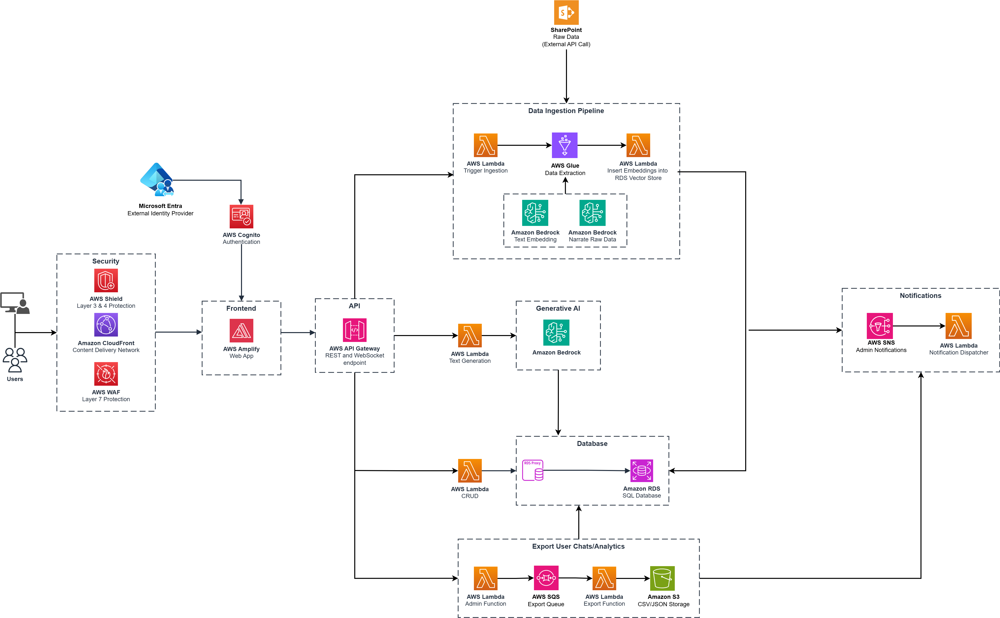

# Knowledge Bridge
An AI-powered RAG assistant for finding and retrieving information from SharePoint knowledge bases. Documents are ingested via AWS Glue, embedded into a pgvector index on RDS PostgreSQL, and retrieved at query time to ground responses from Amazon Bedrock's Claude models.

| Index | Description |
| :---------------------------------------------------- | :------------------------------------------------------ |
| [High Level Architecture](#high-level-architecture) | High level overview illustrating component interactions |
| [Deployment](#deployment-guide) | How to deploy the project |
| [User Guide](#user-guide) | The working solution |
| [Data Ingestion](#data-ingestion) | How SharePoint content is ingested and indexed |
| [Directories](#directories) | General project directory structure |
| [Additional Documentation](#additional-documentation) | Comprehensive guides and references |
| [Credits](#credits) | Meet the team behind the solution |
| [License](#license) | License details |

## High-Level Architecture

The following architecture diagram illustrates the various AWS components utilized to deliver the solution. For an in-depth explanation of the frontend and backend stacks, please look at the [Architecture Deep Dive](Docs/ARCHITECTURE_DEEP_DIVE.md).



## Deployment Guide

To deploy this solution, please follow the steps laid out in the [Deployment Guide](Docs/DEPLOYMENT_GUIDE.md).

## User Guide

Please refer to the [Web App User Guide](Docs/USER_GUIDE.md) for instructions on navigating the web app interface.

## Data Ingestion

Documents are sourced from SharePoint via the Microsoft Graph API. An AWS Glue Python Shell job fetches list items, chunks and embeds them using Cohere Embed English v3 (via Amazon Bedrock), and upserts the resulting vectors into a pgvector table on RDS PostgreSQL. Ingestion can be triggered manually from the admin dashboard or run on a configurable automated schedule.

For setup instructions (SharePoint credentials, Glue IAM role, Secrets Manager configuration), refer to the [Deployment Guide](Docs/DEPLOYMENT_GUIDE.md).

## Directories

```
├── cdk/
│   ├── bin/
│   │   └── cdk.ts
│   ├── glue/
│   │   └── sharepoint_ingestion.py      # Glue Python Shell job
│   ├── lambda/
│   │   ├── adminAuthorizerFunction/
│   │   │   └── adminAuthorizerFunction.js
│   │   ├── authorization/
│   │   │   ├── addAdminOnSignUp.js
│   │   │   ├── initializeConnection.js
│   │   │   ├── preSignUp.js
│   │   │   └── userAuthorizerFunction.js
│   │   ├── db_setup/
│   │   │   ├── migrations/
│   │   │   │   └── 000_initial_schema.js
│   │   │   └── index.js
│   │   ├── handlers/
│   │   │   ├── exports/
│   │   │   │   ├── analyticsExport.js
│   │   │   │   ├── chatExport.js
│   │   │   │   └── index.js
│   │   │   ├── utils/
│   │   │   │   ├── cors.js
│   │   │   │   ├── handlerUtils.js
│   │   │   │   ├── notificationWriter.js
│   │   │   │   ├── publishNotification.js
│   │   │   │   └── validation.js
│   │   │   ├── adminHandler.js
│   │   │   ├── chatSessionHandler.js
│   │   │   ├── exportProcessorHandler.js
│   │   │   ├── glueStatusSync.js
│   │   │   ├── initializeConnection.js
│   │   │   ├── notificationDispatcher.js
│   │   │   ├── sqlRunner.js
│   │   │   ├── systemMessagesHandler.js
│   │   │   └── userHandler.js
│   │   ├── publicTokenFunction/
│   │   │   ├── cors.js
│   │   │   └── publicTokenFunction.js
│   │   ├── textGeneration/
│   │   │   ├── helpers/
│   │   │   ├── main.py
│   │   │   └── requirements.txt
│   │   └── websocket/
│   │       ├── connect.js
│   │       ├── default.js
│   │       └── disconnect.js
│   ├── layers/
│   │   ├── aws-jwt-verify.zip
│   │   ├── node-pg-migrate.zip
│   │   ├── postgres.zip
│   │   └── psycopg2.zip
│   ├── lib/
│   │   ├── amplify-stack.ts
│   │   ├── api-stack.ts
│   │   ├── cicd-stack.ts
│   │   ├── database-stack.ts
│   │   ├── dbFlow-stack.ts
│   │   ├── glue-stack.ts
│   │   └── vpc-stack.ts
│   └── OpenAPI_Swagger_Definition.yaml
│
├── Docs/
│   ├── media/
│   ├── API_DOCUMENTATION.md
│   ├── ARCHITECTURE_DEEP_DIVE.md
│   ├── AWS_MANAGED_KEYS.md
│   ├── BEDROCK_GUARDRAILS.md
│   ├── DATABASE_MIGRATIONS.md
│   ├── DEPENDENCY_MANAGEMENT.MD
│   ├── DEPLOYMENT_GUIDE.md
│   ├── MODIFICATION_GUIDE.md
│   ├── SECURITY_OVERVIEW.md
│   └── USER_GUIDE.md
│
└── frontend/
    └── src/
        ├── assets/
        ├── components/
        │   ├── Admin/
        │   ├── ChatInterface/
        │   └── ui/
        ├── functions/
        ├── hooks/
        ├── layouts/
        ├── lib/
        ├── pages/
        │   ├── Admin/
        │   └── ChatInterface/
        ├── providers/
        ├── types/
        ├── App.tsx
        └── main.tsx
```

## Technology Stack

### Frontend

- **React 19** with TypeScript
- **Vite** for build tooling
- **Tailwind CSS** for styling
- **shadcn/ui** (Radix UI) for UI components
- **AWS Amplify** for hosting and Cognito authentication
- **Recharts** for analytics charts
- **React Router** for client-side routing

### Backend

- **AWS Lambda** (Python 3.12 and Node.js 22) for serverless compute
- **Amazon Bedrock** for LLM inference — Claude Haiku 4.5 and Claude Sonnet 4.6 (Anthropic)
- **AWS Glue** (Python Shell) for SharePoint document ingestion and embedding
- **Cohere Embed English v3** (via Amazon Bedrock) for document and query embeddings
- **pgvector on Amazon RDS PostgreSQL** for vector storage and cosine similarity search
- **Microsoft SharePoint** (Graph API) as the content source
- **Amazon S3** for export file storage
- **API Gateway** (REST and WebSocket) for APIs
- **AWS Cognito** with Microsoft Entra ID federation for authentication and authorization

### Infrastructure

- **AWS CDK** (TypeScript) for infrastructure as code
- **Amazon RDS** with RDS Proxy for managed PostgreSQL
- **Amazon VPC** for network isolation (Glue and Lambda run in the same VPC as RDS)

## Additional Documentation

### Architecture and Design

- **[Architecture Deep Dive](Docs/ARCHITECTURE_DEEP_DIVE.md)**: Comprehensive overview of system architecture and component interactions
- **[Security Overview](Docs/SECURITY_OVERVIEW.md)**: Security architecture, controls, and compliance summary

### Deployment and Configuration

- **[Deployment Guide](Docs/DEPLOYMENT_GUIDE.md)**: Step-by-step instructions for deploying to AWS
- **[Modification Guide](Docs/MODIFICATION_GUIDE.md)**: Guidelines for customizing and extending the application
- **[Bedrock Guardrails](Docs/BEDROCK_GUARDRAILS.md)**: Configuration and management of AWS Bedrock guardrails for AI safety

### Development and Maintenance

- **[Database Migrations](Docs/DATABASE_MIGRATIONS.md)**: Guide to the database migration system and best practices
- **[Dependency Management](Docs/DEPENDENCY_MANAGEMENT.MD)**: Managing Python dependencies in Lambda functions using pip-tools

### API and Usage

- **[API Documentation](Docs/API_DOCUMENTATION.md)**: Comprehensive API reference for all REST and WebSocket endpoints
- **[User Guide](Docs/USER_GUIDE.md)**: Complete guide for end-users on how to interact with Knowledge Bridge

## Credits

This application was architected and developed by the UBC Cloud Innovation Centre (CIC) team. Thanks to the UBC CIC Technical and Project Management teams for their guidance and support.

## License

This project is distributed under the [MIT License](LICENSE).

Licenses of third-party libraries and services used by this system:

**[PostgreSQL License](https://www.postgresql.org/about/licence/)**
For PostgreSQL — a liberal open source license, similar to BSD or MIT.

**[Cohere Terms of Use](https://cohere.com/terms-of-use)**
For Cohere Embed English v3, accessed via Amazon Bedrock for vector embeddings.

**[Anthropic Usage Policy](https://www.anthropic.com/legal/aup)**
For Claude Haiku 4.5 and Claude Sonnet 4.6, accessed via Amazon Bedrock for text generation.

**[MIT License](https://opensource.org/licenses/MIT)**
For open-source libraries and components used in this project.
